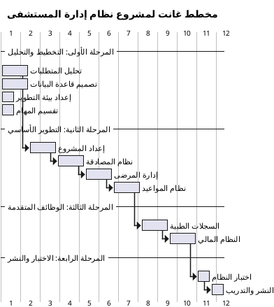
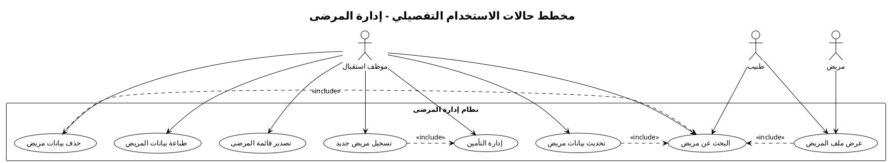
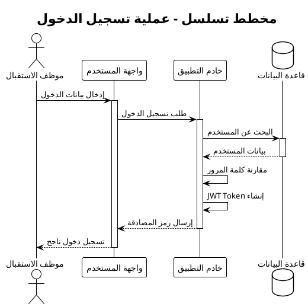
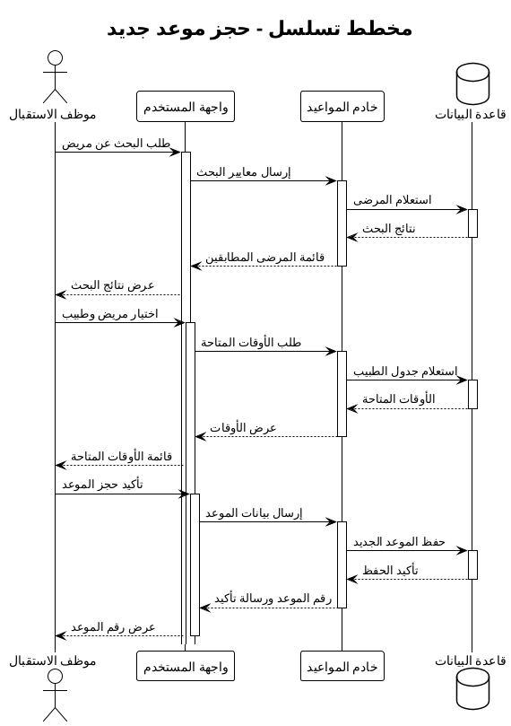
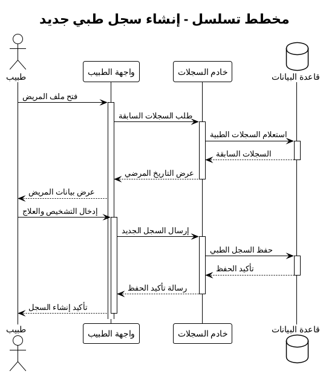
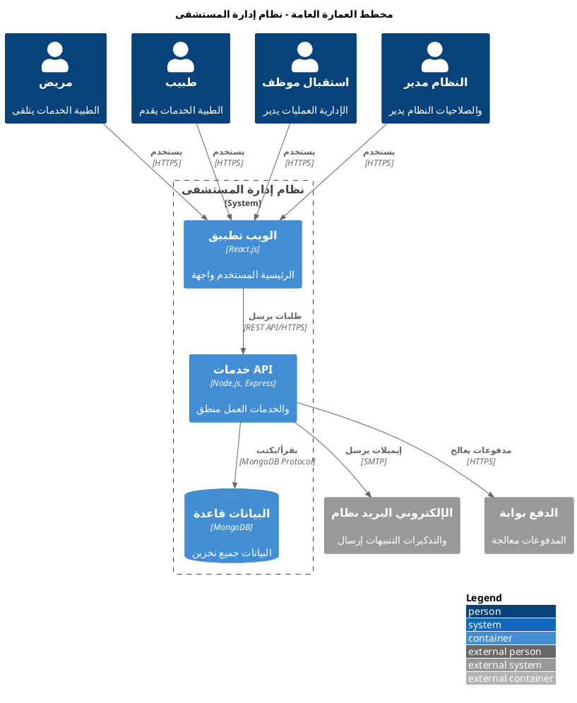

# الفصل الثالث: الدراسة التحليلية وإدارة المشروع

## 3.1 مقدمة

يُعد التخطيط السليم وإدارة المشروع الفعالة من أهم عوامل نجاح أي مشروع تقني، خاصة المشاريع المعقدة مثل أنظمة إدارة المستشفيات. يهدف هذا الفصل إلى عرض الدراسة التحليلية الشاملة للمشروع والتي تشمل النهج الإداري المتبع، بدءاً من التخطيط الأولي ومبررات المشروع، مروراً بتوزيع المهام وإدارة المخاطر، وانتهاءً بتحليل المتطلبات التفصيلي.

سيتم خلال هذا الفصل تقديم الأدوات والمنهجيات المستخدمة في إدارة المشروع، بما في ذلك مخطط غانت لجدولة المهام، ومصفوفة المسؤوليات لتوضيح أدوار أعضاء الفريق، بالإضافة إلى تحليل شامل للمتطلبات الوظيفية وغير الوظيفية مع مخططات حالات الاستخدام.

## 3.2 التخطيط للمشروع ومبرراته

### 3.2.1 مبررات إنشاء المشروع

#### الحاجة الملحة للرقمنة في القطاع الصحي

**الدوافع الأساسية:**

- **التحول الرقمي العالمي**: ضرورة مواكبة التطورات التقنية في القطاع الصحي
- **تحسين كفاءة الخدمات**: الحاجة لتقليل الأخطاء وزيادة سرعة الخدمات
- **ضغط التكاليف**: ضرورة تقليل التكاليف التشغيلية للمؤسسات الصحية
- **رضا المرضى**: تحسين تجربة المرضى وجودة الرعاية المقدمة

#### المشاكل في الأنظمة الحالية

**التحديات الموجودة:**

- **الاعتماد على الأوراق**: بطء وعرضة للأخطاء والفقدان
- **تجزئة البيانات**: عدم تكامل المعلومات بين الأقسام
- **صعوبة التتبع**: تحديات في متابعة حالات المرضى والمواعيد
- **التقارير اليدوية**: استهلاك وقت كبير لإنتاج التقارير

### 3.2.2 تحليل الجدوى

#### الجدوى التقنية (Technical Feasibility)

**تقييم الإمكانات التقنية:**

- **الخبرات المتوفرة**: فريق مطورين بخبرة في التقنيات المطلوبة
- **البنية التحتية**: توفر البنية التقنية اللازمة للتطوير والنشر
- **التقنيات المناسبة**: استخدام تقنيات مجربة وموثوقة
- **قابلية التنفيذ**: إمكانية إنجاز المشروع خلال الوقت المحدد

**النتيجة:** الجدوى التقنية عالية (85%)

#### الجدوى الاقتصادية (Economic Feasibility)

**تحليل التكلفة والعائد:**

**التكاليف المقدرة:**

- تكلفة التطوير: 50,000 ريال (وقت الفريق والموارد)
- تكلفة البنية التحتية: 20,000 ريال (خوادم واستضافة)
- تكلفة الاختبار والنشر: 10,000 ريال
- **إجمالي التكلفة**: 80,000 ريال

**العوائد المتوقعة:**

- توفير تكاليف تشغيلية: 100,000 ريال سنوياً
- تحسين الكفاءة: قيمة مقدرة 150,000 ريال سنوياً
- تقليل الأخطاء: توفير 50,000 ريال سنوياً

**فترة الاسترداد**: 4 أشهر
**النتيجة:** الجدوى الاقتصادية ممتازة

#### الجدوى التشغيلية (Operational Feasibility)

**تقييم قبول المستخدمين:**

- **سهولة الاستخدام**: تصميم واجهات بديهية
- **التدريب المطلوب**: برنامج تدريب مبسط
- **مقاومة التغيير**: استراتيجية تطبيق تدريجية
- **الدعم الفني**: فريق دعم محلي متجاوب

**النتيجة:** الجدوى التشغيلية جيدة (80%)

### 3.2.3 منهجية إدارة المشروع

#### نموذج التطوير المعتمد: Agile Methodology

**اختيار المنهجية:**
تم اختيار منهجية التطوير المرن (Agile) للأسباب التالية:

- **المرونة**: قدرة على التكيف مع التغييرات
- **التسليم التدريجي**: إمكانية اختبار الوظائف مبكراً
- **التواصل المستمر**: تفاعل مستمر مع المستخدمين
- **الجودة المحسنة**: اختبار مستمر وتحسين تدريجي

#### Sprints التطوير

**Sprint 1 (أسبوعان)**: إعداد البيئة ونظام المصادقة
**Sprint 2 (أسبوعان)**: إدارة المرضى الأساسية
**Sprint 3 (أسبوعان)**: نظام المواعيد
**Sprint 4 (أسبوعان)**: السجلات الطبية
**Sprint 5 (أسبوعان)**: نظام الفوترة
**Sprint 6 (أسبوعان)**: التقارير والتحسينات

## 3.3 فريق المشروع ومصفوفة المسؤوليات

### 3.3.1 أعضاء الفريق وأدوارهم

#### يسان - مدير المشروع وقائد الفريق (Project Manager & Team Lead)

**المسؤوليات الرئيسية:**

- **إدارة المشروع العامة**: تخطيط وتنسيق وتتبع التقدم
- **التواصل مع أصحاب المصلحة**: ربط الفريق بالمستخدمين النهائيين
- **مراجعة الجودة**: ضمان معايير الجودة في جميع المخرجات
- **إدارة المخاطر**: تحديد وإدارة مخاطر المشروع
- **تطوير Backend الأساسي**: Node.js وExpress.js

#### عبدالله - مطور واجهات أمامية رئيسي (Lead Frontend Developer)

**المسؤوليات الرئيسية:**

- **تطوير الواجهات الأمامية**: React.js وTailwindCSS
- **تصميم تجربة المستخدم**: UI/UX للصفحات الرئيسية
- **التكامل مع API**: ربط الواجهات بالخدمات الخلفية
- **اختبار الواجهات**: ضمان جودة وسلاسة التفاعل
- **توثيق الواجهات**: إعداد دليل المستخدم

#### أحمد - مطور قواعد البيانات والخدمات الخلفية (Database & Backend Developer)

**المسؤوليات الرئيسية:**

- **تصميم قاعدة البيانات**: MongoDB schemas وعلاقات البيانات
- **تطوير APIs**: RESTful services للعمليات المختلفة
- **تحسين الأداء**: فهرسة واستعلامات محسنة
- **أمان البيانات**: تطبيق معايير الحماية والتشفير
- **النسخ الاحتياطي**: استراتيجيات حفظ واسترداد البيانات

#### علاء - مطور المزايا المتقدمة ومختص الاختبار (Advanced Features & QA Developer)

**المسؤوليات الرئيسية:**

- **الوظائف المتقدمة**: التقارير والتحليلات والإحصائيات
- **اختبار النظام**: Unit testing وIntegration testing
- **ضمان الجودة**: مراجعة الكود واختبار الوظائف
- **النشر والصيانة**: إعداد بيئة الإنتاج والصيانة
- **التوثيق التقني**: إعداد التوثيق الفني للمطورين

### 3.3.2 مصفوفة المسؤوليات (RACI Matrix)

| المهمة / النشاط          | يسان | عبدالله | أحمد | علاء |
| ------------------------ | ---- | ------- | ---- | ---- |
| **تخطيط المشروع**        | R,A  | C       | C    | C    |
| **تحليل المتطلبات**      | R,A  | C       | C    | I    |
| **تصميم النظام**         | A    | R       | R    | C    |
| **تطوير قاعدة البيانات** | C    | I       | R,A  | C    |
| **تطوير Backend APIs**   | R    | C       | R,A  | C    |
| **تطوير Frontend**       | C    | R,A     | I    | C    |
| **تطوير التقارير**       | C    | C       | C    | R,A  |
| **اختبار النظام**        | A    | C       | C    | R    |
| **النشر والتشغيل**       | A    | C       | C    | R    |
| **التوثيق**              | A    | R       | R    | R    |
| **إدارة المخاطر**        | R,A  | C       | C    | C    |

**الرموز:**

- **R (Responsible)**: مسؤول عن التنفيذ
- **A (Accountable)**: مسؤول عن النتيجة النهائية
- **C (Consulted)**: يُستشار في القرارات
- **I (Informed)**: يُبلغ بالتقدم والنتائج

## 3.4 جدولة المشروع ومخطط غانت

### 3.4.1 المراحل الزمنية للمشروع

#### المرحلة الأولى: التخطيط والتحليل (أسبوعان)

**الأسبوع 1-2:**

- تحليل المتطلبات التفصيلي
- تصميم هيكل قاعدة البيانات
- إعداد بيئة التطوير
- تقسيم المهام وتحديد الأولويات

#### المرحلة الثانية: التطوير الأساسي (6 أسابيع)

**الأسبوع 3-4: البنية الأساسية**

- إعداد المشروع وبيئة العمل
- تطوير نظام المصادقة والأدوار
- إنشاء قاعدة البيانات الأساسية

**الأسبوع 5-6: إدارة المرضى**

- تطوير وحدة تسجيل المرضى
- واجهات إدارة بيانات المرضى
- البحث والفلترة في قوائم المرضى

**الأسبوع 7-8: نظام المواعيد**

- تطوير نظام حجز المواعيد
- إدارة جداول الأطباء
- واجهات عرض وتحديث المواعيد

#### المرحلة الثالثة: الوظائف المتقدمة (4 أسابيع)

**الأسبوع 9-10: السجلات الطبية**

- تطوير نظام السجلات الطبية
- إدارة التشخيصات والأدوية
- ربط السجلات بالمرضى والمواعيد

**الأسبوع 11-12: النظام المالي**

- تطوير نظام الفوترة
- إدارة المدفوعات
- التقارير المالية الأساسية

#### المرحلة الرابعة: الاختبار والنشر (أسبوعان)

**الأسبوع 13-14:**

- اختبار شامل للنظام
- إصلاح الأخطاء والتحسينات
- إعداد بيئة الإنتاج والنشر
- التوثيق النهائي والتدريب

### 3.4.2 مخطط غانت للمشروع

## 3.5 إدارة المخاطر

### 3.5.1 تحديد المخاطر المحتملة

#### مخاطر تقنية (Technical Risks)

**1. تعقيد التكامل:**

- **الوصف**: صعوبة في تكامل المكونات المختلفة
- **الاحتمالية**: متوسطة (40%)
- **التأثير**: عالي
- **الاستراتيجية**: اختبار التكامل المبكر والتطوير التدريجي

**2. مشاكل الأداء:**

- **الوصف**: بطء في النظام مع زيادة البيانات
- **الاحتمالية**: منخفضة (25%)
- **التأثير**: متوسط
- **الاستراتيجية**: تحسين قواعد البيانات واختبار الأحمال

#### مخاطر إدارية (Management Risks)

**1. تجاوز الوقت المحدد:**

- **الوصف**: تأخير في إنجاز المهام المخطط لها
- **الاحتمالية**: متوسطة (35%)
- **التأثير**: متوسط
- **الاستراتيجية**: مراقبة مستمرة وإعادة تقييم الأولويات

**2. نقص الخبرة:**

- **الوصف**: تحديات في تقنيات جديدة لبعض أعضاء الفريق
- **الاحتمالية**: منخفضة (20%)
- **التأثير**: منخفض
- **الاستراتيجية**: تدريب مسبق وتبادل المعرفة

#### مخاطر خارجية (External Risks)

**1. تغيير المتطلبات:**

- **الوصف**: طلبات تغيير من المستخدمين أثناء التطوير
- **الاحتمالية**: عالية (60%)
- **التأثير**: متوسط
- **الاستراتيجية**: توثيق واضح للمتطلبات ونهج مرن للتطوير

### 3.5.2 استراتيجيات التعامل مع المخاطر

#### خطط الطوارئ (Contingency Plans)

**1. فريق الدعم التقني:**

- إشراك خبراء خارجيين عند الحاجة
- مراجعة دورية للكود مع مطورين ذوي خبرة

**2. مرونة في الجدولة:**

- احتياطي زمني 15% لكل مرحلة
- إمكانية إعادة ترتيب الأولويات

**3. نسخ احتياطية مستمرة:**

- نسخ يومية للكود والبيانات
- استخدام Git لإدارة الإصدارات

## 3.6 تحليل المتطلبات التفصيلي

### 3.6.1 المتطلبات الوظيفية (Functional Requirements)

#### متطلبات نظام المصادقة والتوثيق

**FR-001: تسجيل الدخول**

- **الوصف**: يجب أن يتمكن المستخدمون من تسجيل الدخول باستخدام اسم المستخدم وكلمة المرور
- **الأولوية**: عالية
- **المدخلات**: اسم المستخدم، كلمة المرور
- **المخرجات**: رمز مصادقة، بيانات المستخدم
- **القيود**: محاولات محدودة، انتهاء صلاحية الجلسة

**FR-002: إدارة الأدوار والصلاحيات**

- **الوصف**: تحديد صلاحيات كل دور للوصول للوظائف المختلفة
- **الأولوية**: عالية
- **المدخلات**: نوع المستخدم، الموديول المطلوب
- **المخرجات**: قرار السماح أو المنع
- **القيود**: صلاحيات محددة مسبقاً لكل دور

#### متطلبات إدارة المرضى

**FR-003: تسجيل مريض جديد**

- **الوصف**: إضافة بيانات مريض جديد للنظام
- **الأولوية**: عالية
- **المدخلات**: البيانات الشخصية، التاريخ المرضي، بيانات التأمين
- **المخرجات**: رقم مريض فريد، رسالة تأكيد
- **القيود**: البيانات الإجبارية، تفرد رقم الهوية

**FR-004: البحث عن المرضى**

- **الوصف**: البحث في قاعدة بيانات المرضى بمعايير متعددة
- **الأولوية**: متوسطة
- **المدخلات**: الاسم، رقم الهوية، رقم الهاتف
- **المخرجات**: قائمة المرضى المطابقين
- **القيود**: عرض البيانات حسب الصلاحيات

#### متطلبات نظام المواعيد

**FR-005: حجز موعد جديد**

- **الوصف**: جدولة موعد جديد للمريض مع طبيب محدد
- **الأولوية**: عالية
- **المدخلات**: المريض، الطبيب، التاريخ، الوقت، نوع الموعد
- **المخرجات**: رقم الموعد، تأكيد الحجز
- **القيود**: عدم تعارض الأوقات، توفر الطبيب

**FR-006: إدارة حالات المواعيد**

- **الوصف**: تحديث حالة الموعد (مؤكد، مكتمل، ملغي، إلخ)
- **الأولوية**: متوسطة
- **المدخلات**: رقم الموعد، الحالة الجديدة، ملاحظات
- **المخرجات**: تأكيد التحديث
- **القيود**: صلاحيات التحديث، حالات مسموحة

### 3.6.2 المتطلبات غير الوظيفية (Non-Functional Requirements)

#### متطلبات الأداء (Performance Requirements)

**NFR-001: زمن الاستجابة**

- **المعيار**: أقل من 3 ثوانٍ لجميع العمليات
- **القياس**: متوسط وقت الاستجابة للصفحات
- **البيئة**: ظروف تشغيل عادية
- **الأهمية**: عالية

**NFR-002: الإنتاجية**

- **المعيار**: دعم 100 مستخدم متزامن
- **القياس**: عدد الطلبات المتزامنة المدعومة
- **البيئة**: خادم متوسط المواصفات
- **الأهمية**: متوسطة

#### متطلبات الأمان (Security Requirements)

**NFR-003: تشفير البيانات**

- **المعيار**: AES-256 للبيانات المحفوظة، TLS 1.3 للنقل
- **القياس**: مستوى التشفير المطبق
- **البيئة**: جميع البيانات الحساسة
- **الأهمية**: عالية جداً

**NFR-004: المصادقة الآمنة**

- **المعيار**: JWT مع انتهاء صلاحية، كلمات مرور مشفرة
- **القياس**: قوة آلية المصادقة
- **البيئة**: جميع نقاط الوصول
- **الأهمية**: عالية جداً

#### متطلبات قابلية الاستخدام (Usability Requirements)

**NFR-005: سهولة التعلم**

- **المعيار**: مستخدم جديد يتقن النظام خلال ساعة واحدة
- **القياس**: وقت التدريب المطلوب
- **البيئة**: مستخدمين بخبرة حاسوبية متوسطة
- **الأهمية**: متوسطة

**NFR-006: دعم اللغة العربية**

- **المعيار**: دعم كامل للعربية مع RTL
- **القياس**: نسبة النصوص المترجمة
- **البيئة**: جميع واجهات النظام
- **الأهمية**: عالية

## 3.7 تحليل الفاعلين (Stakeholders Analysis)

### 3.7.1 الفاعلين الأساسيين (Primary Stakeholders)

#### المرضى (Patients)

**الدور**: المستفيدون النهائيون من النظام
**التوقعات**:

- سهولة في حجز المواعيد
- حفظ آمن للبيانات الطبية
- سرعة في الخدمة
- شفافية في الفواتير

**مؤشرات النجاح**:

- تقليل وقت الانتظار بنسبة 40%
- رضا المرضى أكثر من 85%

#### الأطباء (Doctors)

**الدور**: مستخدمون رئيسيون للنظام
**التوقعات**:

- وصول سريع للسجلات الطبية
- واجهات سهلة لإدخال البيانات
- تقارير شاملة عن المرضى
- أدوات مساعدة في التشخيص

**مؤشرات النجاح**:

- تقليل وقت إدخال البيانات بنسبة 50%
- رضا الأطباء أكثر من 80%

#### الموظفون الإداريون (Administrative Staff)

**الدور**: مشغلون يوميون للنظام
**التوقعات**:

- واجهات بديهية وسريعة
- تقارير إدارية شاملة
- نظام فوترة دقيق
- أدوات إدارة المواعيد

**مؤشرات النجاح**:

- تحسين الكفاءة الإدارية بنسبة 60%
- تقليل الأخطاء الإدارية بنسبة 70%

### 3.7.2 الفاعلين الثانويون (Secondary Stakeholders)

#### إدارة المستشفى (Hospital Management)

**الدور**: صناع القرار ومصادقون على المشروع
**التوقعات**:

- عائد على الاستثمار واضح
- تحسين مؤشرات الأداء
- امتثال للمعايير والقوانين
- تقارير إدارية متقدمة

#### شركات التأمين (Insurance Companies)

**الدور**: شركاء في النظام المالي
**التوقعات**:

- تبادل بيانات آمن
- دقة في المطالبات
- تقارير مالية موثوقة

#### الجهات الرقابية (Regulatory Bodies)

**الدور**: مراقبون للامتثال
**التوقعات**:

- امتثال للمعايير الصحية
- حماية بيانات المرضى
- تقارير للسلطات الصحية

## 3.8 مخططات حالات الاستخدام (Use Case Diagrams)

### 3.8.1 مخطط حالات الاستخدام العام

```plantuml
@startuml
!theme plain
title مخطط حالات الاستخدام العام - نظام إدارة المستشفى

actor "مدير النظام" as Admin
actor "طبيب" as Doctor
actor "موظف استقبال" as Reception
actor "مريض" as Patient

rectangle "نظام إدارة المستشفى" {
  usecase "إدارة المستخدمين" as UC1
  usecase "إدارة الصلاحيات" as UC2
  usecase "عرض التقارير" as UC3
  usecase "إدارة النظام" as UC4

  usecase "عرض المرضى" as UC5
  usecase "إدارة المواعيد" as UC6
  usecase "كتابة تشخيص" as UC7
  usecase "وصف علاج" as UC8
  usecase "عرض السجلات" as UC9

  usecase "تسجيل مريض" as UC10
  usecase "حجز موعد" as UC11
  usecase "إدارة الفواتير" as UC12
  usecase "طباعة تقارير" as UC13

  usecase "عرض المواعيد" as UC14
  usecase "عرض الفواتير" as UC15
}

Admin --> UC1
Admin --> UC2
Admin --> UC3
Admin --> UC4

Doctor --> UC5
Doctor --> UC6
Doctor --> UC7
Doctor --> UC8
Doctor --> UC9

Reception --> UC10
Reception --> UC11
Reception --> UC12
Reception --> UC13

Patient --> UC14
Patient --> UC15

@enduml
```

### 3.8.2 مخطط حالات الاستخدام التفصيلي - إدارة المرضى

### 3.8.3 مخططات التسلسل (Sequence Diagrams)

#### مخطط تسلسل: عملية تسجيل الدخول

#### مخطط تسلسل: حجز موعد جديد

#### مخطط تسلسل: إنشاء سجل طبي جديد

### 3.8.4 مخطط العمارة العامة للنظام

## 3.9 خلاصة الفصل

لقد تم في هذا الفصل عرض الدراسة التحليلية الشاملة لمشروع نظام إدارة المستشفى، والتي شملت جميع الجوانب الإدارية والتقنية اللازمة لنجاح المشروع.

### الإنجازات الرئيسية للفصل:

**1. تحليل الجدوى الشامل**: أكدت الدراسة جدوى المشروع من الناحية التقنية والاقتصادية والتشغيلية، مع فترة استرداد قصيرة (4 أشهر) وعوائد واضحة.

**2. التخطيط المنهجي**: تم وضع خطة زمنية واقعية موزعة على 14 أسبوعاً، مع تطبيق منهجية Agile لضمان المرونة والجودة.

**3. تنظيم الفريق**: توزيع واضح ومتوازن للمسؤوليات بين أعضاء الفريق الأربعة، مع تحديد دقيق للأدوار والمهام.

**4. إدارة المخاطر**: تحديد استباقي للمخاطر المحتملة مع وضع استراتيجيات فعالة للتعامل معها.

**5. تحليل المتطلبات المفصل**: توثيق شامل للمتطلبات الوظيفية وغير الوظيفية مع معايير واضحة للقياس.

**6. النمذجة التحليلية**: مخططات حالات الاستخدام والتسلسل المطورة بـ PlantUML التي توضح تفاعل النظام مع المستخدمين.

هذا التحليل الشامل يوفر أساساً قوياً لمراحل التصميم والتطوير اللاحقة، ويضمن فهماً عميقاً لمتطلبات المشروع وتوقعات جميع الأطراف المعنية.

---

_تم إعداد هذا الفصل وفقاً لأفضل الممارسات في إدارة المشاريع التقنية، ويشكل الدليل المرجعي للتنفيذ الناجح للمشروع._
