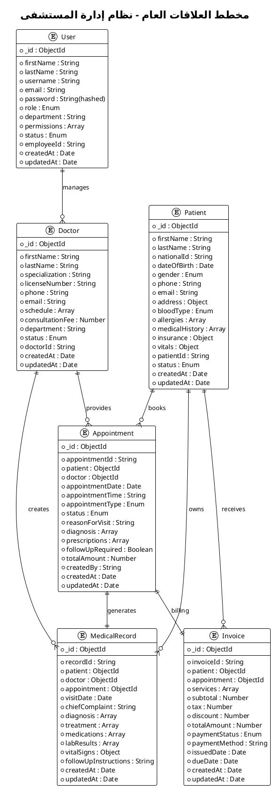
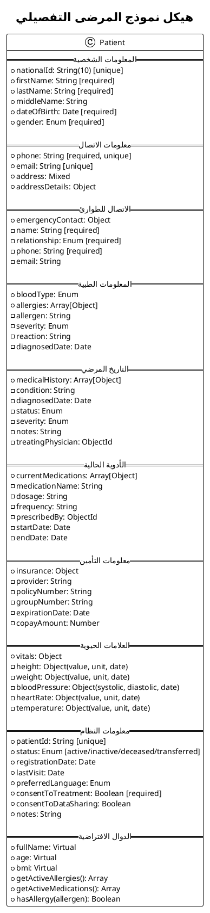
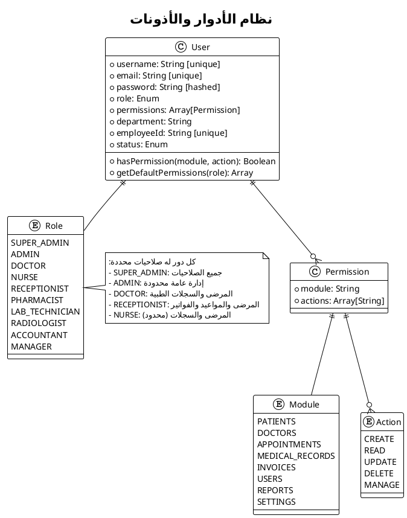
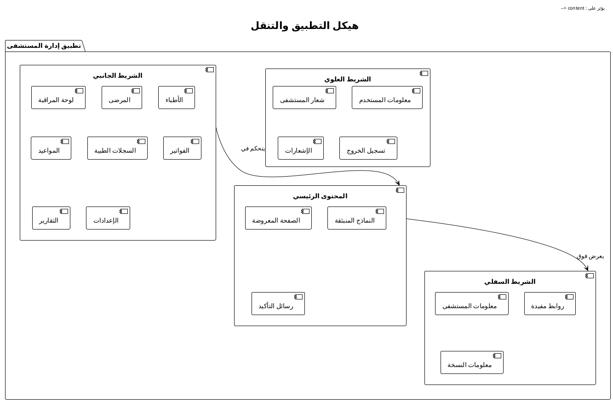
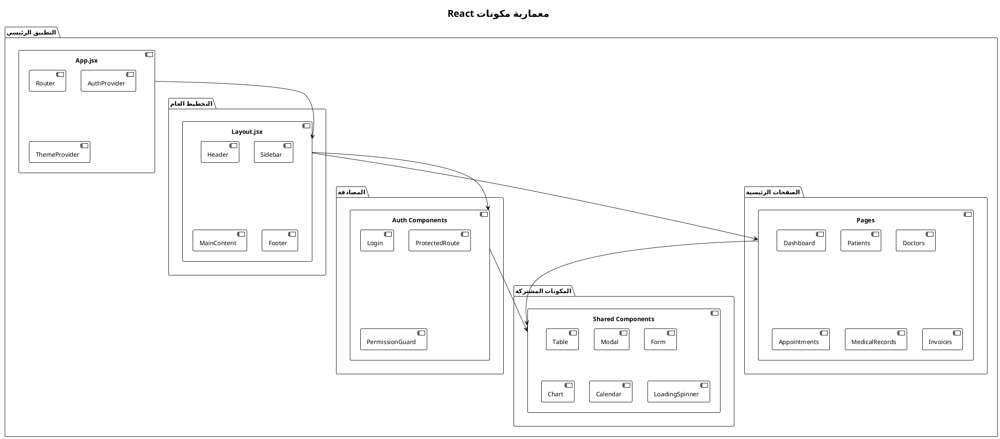

# الفصل الرابع: تصميم النظام والواجهات

## 4.1 مقدمة

يُعد التصميم الجيد لقاعدة البيانات والواجهات من أهم العوامل التي تحدد نجاح أي نظام إدارة مستشفى. في هذا الفصل، سنستعرض القرارات التقنية المتخذة في تصميم نظام إدارة المستشفى، بدءاً من اختيار تقنية قاعدة البيانات وتصميم هيكلها، مروراً بتصميم واجهات المستخدم، وانتهاءً بعرض الصفحات الرئيسية للنظام وطريقة عملها.

## 4.2 تصميم قاعدة البيانات

### 4.2.1 اختيار تقنية قاعدة البيانات

#### MongoDB - قاعدة البيانات المختارة

تم اختيار **MongoDB** كقاعدة بيانات أساسية للنظام للأسباب التالية:

**المزايا التقنية:**

- **المرونة في الهيكل**: قدرة على تخزين بيانات معقدة دون قيود الجداول الثابتة
- **الأداء العالي**: سرعة في عمليات القراءة والكتابة للبيانات الكبيرة
- **التوسع الأفقي**: إمكانية توزيع البيانات على خوادم متعددة
- **دعم JSON الأصلي**: تكامل مثالي مع تطبيقات JavaScript

**الملاءمة للمجال الطبي:**

- **البيانات الطبية المعقدة**: السجلات الطبية تحتوي على هياكل بيانات متنوعة
- **التاريخ المرضي المتغير**: إمكانية إضافة حقول جديدة دون تعديل الهيكل
- **البيانات الاختيارية**: العديد من الحقول الطبية قد تكون فارغة

### 4.2.2 نماذج قاعدة البيانات الرئيسية

#### 4.2.2.1 نموذج المرضى (Patient Model)

يحتوي نموذج المرضى على **445 حقل شامل** موزع على:

**المعلومات الشخصية:**

- البيانات الأساسية: الاسم، تاريخ الميلاد، الجنس
- معلومات الاتصال: الهاتف، البريد الإلكتروني، العنوان
- جهة الاتصال للطوارئ: الاسم، العلاقة، الهاتف

**المعلومات الطبية:**

- فصيلة الدم والحساسيات
- التاريخ المرضي والأدوية الحالية
- العلامات الحيوية (الطول، الوزن، ضغط الدم)
- معلومات التأمين الصحي

#### 4.2.2.2 نموذج الأطباء (Doctor Model)

يشمل **607 سطر برمجي** يغطي:

**المعلومات المهنية:**

- التخصص والتخصص الفرعي
- رقم الترخيص وتاريخ انتهائه
- سنوات الخبرة والمنصب

**الجدولة والتوفر:**

- جدول العمل الأسبوعي
- أوقات الراحة والإجازات
- رسوم الاستشارة والمتابعة

#### 4.2.2.3 نموذج المستخدمين (User Model)

نظام أذونات متقدم يتضمن **10 أدوار مختلفة**:

- `super_admin` - مدير النظام الرئيسي
- `admin` - مدير المستشفى
- `doctor` - طبيب
- `nurse` - ممرض/ممرضة
- `receptionist` - موظف استقبال
- `pharmacist` - صيدلي
- `lab_technician` - فني مختبر
- `radiologist` - أخصائي أشعة
- `accountant` - محاسب
- `manager` - مدير قسم

#### 4.2.2.4 نموذج المواعيد (Appointment Model)

يدعم **12 نوع موعد** و**8 حالات مختلفة**:

**أنواع المواعيد:**

- استشارة، متابعة، فحص روتيني، طوارئ
- إجراء طبي، جراحة، تشخيص، فحص وقائي

**حالات الموعد:**

- مجدول، مؤكد، حضور، قيد التنفيذ
- مكتمل، ملغي، غياب، مُعاد جدولة

### 4.2.3 مخططات قاعدة البيانات

#### 4.2.3.1 مخطط ERD العام للنظام



#### 4.2.3.2 مخطط تفصيلي لنموذج المرضى



#### 4.2.3.3 مخطط علاقات المواعيد

```plantuml
@startuml
!theme plain
title نموذج المواعيد وعلاقاته

entity "Appointment" as apt {
  * _id : ObjectId
  * appointmentId : String
  --
  * patient : ObjectId → Patient
  * doctor : ObjectId → Doctor
  * appointmentDate : Date
  * appointmentTime : String
  * estimatedDuration : Number
  --
  appointmentType : Enum {
    consultation
    follow-up
    routine-checkup
    emergency
    procedure
    surgery
    diagnostic
    screening
    vaccination
    counseling
    second-opinion
    referral
  }
  --
  status : Enum {
    scheduled
    confirmed
    checked-in
    in-progress
    completed
    cancelled
    no-show
    rescheduled
  }
  --
  priority : Enum {
    low
    normal
    high
    urgent
    emergency
  }
}

entity "VitalSigns" as vitals {
  bloodPressure : Object
  heartRate : Object
  temperature : Object
  weight : Object
  height : Object
  oxygenSaturation : Object
}

entity "Diagnosis" as diag {
  condition : String
  icdCode : String
  severity : Enum
  status : Enum
  notes : String
}

entity "Prescription" as presc {
  medication : String
  dosage : String
  frequency : String
  duration : String
  instructions : String
  quantity : Number
  refills : Number
}

entity "LabTest" as lab {
  testName : String
  testCode : String
  urgency : Enum
  instructions : String
  status : Enum
}

entity "Referral" as ref {
  specialization : String
  referredDoctor : ObjectId
  urgency : Enum
  reason : String
  notes : String
}

apt ||--o{ vitals
apt ||--o{ diag
apt ||--o{ presc
apt ||--o{ lab
apt ||--o{ ref

@enduml
```

#### 4.2.3.4 مخطط نظام الأذونات والأدوار



## 4.3 تصميم واجهات المستخدم

### 4.3.1 مبادئ التصميم المتبعة

#### تجربة المستخدم (UX Design)

**المبادئ الأساسية:**

- **البساطة**: واجهات بديهية لا تحتاج تدريب مكثف
- **الوضوح**: ترتيب منطقي للمعلومات والوظائف
- **الاتساق**: نمط موحد عبر جميع الصفحات
- **إمكانية الوصول**: دعم كامل للغة العربية مع RTL

#### تصميم الواجهة (UI Design)

**التقنيات المستخدمة:**

- **React.js**: مكتبة بناء واجهات المستخدم التفاعلية
- **TailwindCSS**: إطار عمل CSS للتصميم السريع
- **Framer Motion**: مكتبة الحركات والانتقالات
- **React Router**: نظام التنقل بين الصفحات

### 4.3.2 هيكل التطبيق العام

#### نظام التنقل الرئيسي



## 4.4 الصفحات الرئيسية للنظام

### 4.4.1 صفحة لوحة المراقبة (Dashboard)

#### وصف الصفحة

تُعد لوحة المراقبة الصفحة الرئيسية التي يراها المستخدم عند تسجيل الدخول، وتقدم نظرة شاملة على حالة المستشفى والأنشطة اليومية.

#### المكونات الرئيسية

**مؤشرات الأداء السريعة (KPIs):**

- إجمالي المرضى المسجلين
- المواعيد اليوم
- الأطباء المتاحين
- الإيرادات الشهرية

**الرسوم البيانية التفاعلية:**

- معدل زيارات المرضى الشهرية
- توزيع المواعيد حسب التخصص
- الإيرادات السنوية
- معدلات رضا المرضى

**الجداول المحدثة:**

- المواعيد القادمة
- المرضى الجدد اليوم
- المهام المعلقة
- الإشعارات المهمة

#### مكان لقطة الشاشة

```
[سيتم إدراج لقطة شاشة للوحة المراقبة هنا]
- إظهار المؤشرات الرئيسية
- الرسوم البيانية التفاعلية
- الجداول المحدثة في الوقت الفعلي
```

#### وظائف متقدمة

- **التخصيص**: إمكانية إعادة ترتيب المكونات حسب تفضيل المستخدم
- **الفلترة**: عرض البيانات حسب فترات زمنية محددة
- **التصدير**: تصدير التقارير السريعة بصيغة PDF أو Excel
- **التنبيهات**: إشعارات فورية للأحداث المهمة

### 4.4.2 صفحة إدارة المرضى (Patients Management)

#### الواجهة الرئيسية

**شريط البحث المتقدم:**

- البحث بالاسم، رقم الهوية، أو رقم الهاتف
- فلترة حسب العمر، الجنس، أو حالة التأمين
- ترتيب النتائج حسب تاريخ التسجيل أو آخر زيارة

**جدول المرضى:**

- عرض البيانات الأساسية (الاسم، العمر، الهاتف)
- حالة المريض (نشط، غير نشط، متوفى)
- تاريخ آخر زيارة
- أزرار الإجراءات السريعة

#### مكان لقطة الشاشة

```
[سيتم إدراج لقطة شاشة لصفحة المرضى هنا]
- عرض جدول المرضى مع أدوات البحث
- النماذج المنبثقة لإضافة/تعديل المرضى
- صفحة تفاصيل المريض الكاملة
```

#### نماذج إدارة المرضى

**نموذج تسجيل مريض جديد:**

- **تبويب المعلومات الشخصية**: الاسم، تاريخ الميلاد، الجنس
- **تبويب معلومات الاتصال**: الهاتف، البريد، العنوان التفصيلي
- **تبويب الاتصال للطوارئ**: اسم جهة الاتصال والعلاقة
- **تبويب المعلومات الطبية**: فصيلة الدم، الحساسيات، التاريخ المرضي
- **تبويب التأمين**: شركة التأمين، رقم البوليصة، نسبة التغطية

**نموذج تعديل بيانات المريض:**

- جميع حقول التسجيل مع إمكانية التعديل
- سجل التغييرات والتحديثات
- خيارات حفظ أو إلغاء التعديلات

#### صفحة تفاصيل المريض

**نظرة عامة سريعة:**

- الصورة الشخصية والبيانات الأساسية
- مؤشرات العلامات الحيوية الحالية (BMI، ضغط الدم)
- معلومات التأمين والتغطية
- حالة المريض والمخاطر الطبية

**تبويبات مفصلة:**

- **السجل الطبي**: جميع الزيارات والتشخيصات السابقة
- **المواعيد**: المواعيد المجدولة والتاريخ الطبي للمواعيد
- **الأدوية**: قائمة الأدوية الحالية والسابقة مع التفاصيل
- **التحاليل والأشعة**: نتائج المختبرات والصور الطبية
- **الفواتير**: السجل المالي وحالة المدفوعات

### 4.4.3 صفحة إدارة الأطباء (Doctors Management)

#### واجهة عرض الأطباء

**بطاقات الأطباء:**

- الصورة الشخصية والاسم
- التخصص والدرجة العلمية
- سنوات الخبرة والتقييم
- حالة التوفر (متاح، مشغول، في إجازة)

**فلترة وترتيب:**

- حسب التخصص (باطني، جراحة، أطفال، إلخ)
- حسب سنوات الخبرة
- حسب التقييم والمراجعات
- حسب التوفر الحالي

#### مكان لقطة الشاشة

```
[سيتم إدراج لقطة شاشة لصفحة الأطباء هنا]
- عرض بطاقات الأطباء مع معلوماتهم الأساسية
- أدوات الفلترة والبحث
- صفحة الملف الشخصي التفصيلي للطبيب
```

#### الملف الشخصي للطبيب

**المعلومات المهنية:**

- التخصص والتخصص الفرعي
- المؤهلات والشهادات
- الخبرات السابقة والإنجازات
- اللغات المتحدث بها

**الجدولة والتوفر:**

- جدول العمل الأسبوعي
- المواعيد المحجوزة والمتاحة
- أوقات الراحة والإجازات المخططة
- الحد الأقصى للمرضى يومياً

**الإحصائيات والأداء:**

- عدد المرضى المعالجين
- متوسط وقت الانتظار
- معدل رضا المرضى
- معدل إلغاء المواعيد

### 4.4.4 صفحة إدارة المواعيد (Appointments Management)

#### واجهة التقويم التفاعلي

**عرض التقويم:**

- عرض شهري مع المواعيد المجدولة
- عرض أسبوعي تفصيلي لكل طبيب
- عرض يومي مع جدولة دقيقة بالدقائق
- ألوان مختلفة حسب حالة الموعد

**أدوات إدارة المواعيد:**

- سحب وإسقاط المواعيد لإعادة الجدولة
- البحث السريع عن موعد بالمريض أو الطبيب
- فلترة حسب نوع الموعد أو الحالة
- تصدير جدول المواعيد للطباعة

#### مكان لقطة الشاشة

```
[سيتم إدراج لقطة شاشة لصفحة المواعيد هنا]
- التقويم التفاعلي مع المواعيد الملونة
- نماذج حجز وتعديل المواعيد
- قوائم انتظار المرضى
```

#### نموذج حجز موعد جديد

**الخطوة الأولى - اختيار المريض:**

- البحث عن المريض أو إضافة مريض جديد
- عرض المعلومات الأساسية والتأمين
- التحقق من التاريخ الطبي والحساسيات

**الخطوة الثانية - اختيار الطبيب:**

- قائمة الأطباء حسب التخصص المطلوب
- عرض التوفر والأوقات المناسبة
- مقارنة رسوم الاستشارة

**الخطوة الثالثة - تحديد التفاصيل:**

- نوع الموعد (استشارة، متابعة، طوارئ)
- سبب الزيارة والأعراض الحالية
- التأكد من معلومات التأمين والتغطية

**الخطوة الرابعة - التأكيد:**

- مراجعة جميع التفاصيل
- اختيار طريقة الدفع
- إرسال تذكيرات للمريض

#### إدارة حالات المواعيد

**لوحة تتبع المواعيد:**

- قائمة المواعيد اليوم حسب الحالة
- أوقات الوصول والانتظار
- تحديث الحالات في الوقت الفعلي

**حالات الموعد:**

- **مجدول**: تم حجز الموعد ولم يتم تأكيده
- **مؤكد**: تم تأكيد الموعد من قبل المريض
- **حضور**: وصل المريض وتم تسجيل الحضور
- **قيد التنفيذ**: المريض مع الطبيب حالياً
- **مكتمل**: انتهت الاستشارة وتم إنشاء السجل الطبي
- **ملغي**: تم إلغاء الموعد
- **غياب**: لم يحضر المريض في الوقت المحدد
- **مُعاد جدولة**: تم تغيير موعد الزيارة

### 4.4.5 صفحة السجلات الطبية (Medical Records)

#### واجهة السجلات الرئيسية

**فهرسة وتنظيم السجلات:**

- ترتيب السجلات حسب المريض أو التاريخ
- فلترة حسب الطبيب أو نوع الزيارة
- البحث في محتوى السجلات
- أرشفة السجلات القديمة

**أدوات السجلات:**

- إنشاء سجل طبي جديد
- ربط السجل بموعد محدد
- إرفاق الملفات والصور الطبية
- مشاركة السجل مع أطباء آخرين

#### مكان لقطة الشاشة

```
[سيتم إدراج لقطة شاشة للسجلات الطبية هنا]
- قائمة السجلات مع أدوات البحث والفلترة
- نموذج إنشاء سجل طبي جديد
- عرض تفاصيل السجل الطبي
```

#### نموذج إنشاء السجل الطبي

**معلومات الزيارة:**

- تاريخ ووقت الزيارة
- المريض والطبيب المعالج
- نوع الزيارة (استشارة، متابعة، طوارئ)
- مدة الاستشارة

**العلامات الحيوية:**

- ضغط الدم (الانقباضي/الانبساطي)
- معدل ضربات القلب
- درجة الحرارة
- الوزن والطول
- مستوى الأكسجين في الدم

**الفحص السريري:**

- الشكوى الرئيسية
- تاريخ المرض الحالي
- الفحص الطبي
- النتائج والملاحظات

**التشخيص والعلاج:**

- التشخيص الأولي والنهائي
- كود التشخيص الدولي (ICD)
- خطة العلاج
- الأدوية الموصوفة
- تعليمات المتابعة

#### عرض السجل الطبي التفصيلي

**ملخص السجل:**

- معلومات أساسية عن الزيارة
- التشخيص الرئيسي
- الأدوية المقررة
- تاريخ المتابعة المطلوب

**التفاصيل الطبية:**

- جميع العلامات الحيوية المسجلة
- نتائج الفحوصات والتحاليل
- الصور الطبية والأشعة
- ملاحظات الطبيب التفصيلية

**الأدوية والوصفات:**

- قائمة الأدوية مع الجرعات
- تعليمات تناول الأدوية
- مدة العلاج وعدد مرات التجديد
- تحذيرات وتفاعلات دوائية

### 4.4.6 صفحة إدارة الفواتير (Invoices Management)

#### لوحة تحكم الفواتير

**مؤشرات مالية سريعة:**

- إجمالي الإيرادات الشهرية
- الفواتير المدفوعة والمعلقة
- متوسط قيمة الفاتورة
- معدل التحصيل

**قوائم الفواتير:**

- الفواتير الحديثة
- الفواتير المستحقة
- الفواتير المدفوعة
- الفواتير الملغاة

#### مكان لقطة الشاشة

```
[سيتم إدراج لقطة شاشة لصفحة الفواتير هنا]
- لوحة تحكم الفواتير مع المؤشرات المالية
- جدول الفواتير مع أدوات الفلترة
- نموذج إنشاء فاتورة جديدة
```

#### نموذج إنشاء الفاتورة

**معلومات أساسية:**

- المريض والزيارة المرتبطة
- تاريخ إصدار الفاتورة
- تاريخ الاستحقاق
- العملة ونوع الصرف

**تفاصيل الخدمات:**

- **الخدمات الطبية**: الاستشارة، الفحوصات، الإجراءات
- **التحاليل المخبرية**: أنواع التحاليل وتكلفتها
- **الأدوية**: الأدوية المصروفة من الصيدلية
- **خدمات إضافية**: الأشعة، العلاج الطبيعي، التمريض

**الحسابات المالية:**

- المبلغ الإجمالي قبل الخصم
- خصومات التأمين أو الخصومات الخاصة
- الضرائب المطبقة
- المبلغ النهائي المطلوب

**معلومات الدفع:**

- طرق الدفع المقبولة (نقد، بطاقة، تحويل)
- حالة الدفع (مدفوع، جزئي، معلق)
- تاريخ الدفع ومرجع العملية

#### تقارير مالية متقدمة

**تقارير الإيرادات:**

- الإيرادات اليومية والشهرية والسنوية
- مقارنة الأداء مع الفترات السابقة
- توزيع الإيرادات حسب نوع الخدمة
- تحليل اتجاهات الإيرادات

**تقارير المدفوعات:**

- معدلات التحصيل حسب طريقة الدفع
- الفواتير المتأخرة والديون المعدومة
- تقارير التأمين والمطالبات
- تحليل سلوك الدفع للمرضى

## 4.5 التصميم التقني للواجهات

### 4.5.1 معمارية Frontend

#### هيكل المكونات (Component Architecture)



### 4.5.2 إدارة الحالة (State Management)

#### نمط Context API لإدارة البيانات

**AuthContext - إدارة المصادقة:**

- معلومات المستخدم الحالي
- حالة تسجيل الدخول
- الأذونات والصلاحيات
- وظائف تسجيل الدخول والخروج

**DataContext - إدارة البيانات:**

- بيانات المرضى والأطباء
- حالة التحميل والأخطاء
- التزامن مع الخادم
- التخزين المؤقت المحلي

### 4.5.3 تحسين الأداء (Performance Optimization)

#### استراتيجيات التحسين

- **Lazy Loading**: تحميل المكونات عند الحاجة
- **Memoization**: تخزين النتائج المؤقت للعمليات المكلفة
- **Virtual Scrolling**: عرض البيانات الكبيرة بكفاءة
- **Code Splitting**: تقسيم الكود لتحميل أسرع

#### تحسين تجربة المستخدم

- **Progressive Loading**: تحميل تدريجي للمحتوى
- **Optimistic Updates**: تحديثات فورية مع التراجع عند الخطأ
- **Error Boundaries**: معالجة الأخطاء دون تعطيل التطبيق
- **Responsive Design**: تصميم متجاوب لجميع الأجهزة

## 4.6 الأمان والحماية

### 4.6.1 أمان قاعدة البيانات

#### تشفير البيانات

- **كلمات المرور**: تشفير bcrypt مع salt قوي
- **البيانات الحساسة**: تشفير AES-256 للبيانات الطبية
- **النقل الآمن**: TLS 1.3 لجميع الاتصالات
- **النسخ الاحتياطي**: تشفير النسخ الاحتياطية

#### التحكم في الوصول

- **JWT Tokens**: رموز الوصول مع انتهاء صلاحية
- **Role-Based Access**: تحكم في الوصول حسب الدور
- **Permission Granularity**: صلاحيات دقيقة لكل وظيفة
- **Session Management**: إدارة الجلسات وانتهاء الصلاحية

### 4.6.2 أمان الواجهة الأمامية

#### حماية من الهجمات

- **XSS Protection**: تعقيم المدخلات وحماية من البرمجة العابرة
- **CSRF Prevention**: حماية من هجمات التزوير
- **Input Validation**: فحص وتنظيف جميع المدخلات
- **Content Security Policy**: سياسات أمان المحتوى

#### خصوصية البيانات

- **Data Masking**: إخفاء البيانات الحساسة في الواجهة
- **Audit Logging**: تسجيل جميع العمليات الحساسة
- **User Consent**: موافقة المستخدم على معالجة البيانات
- **Data Retention**: سياسات الاحتفاظ بالبيانات والحذف

## 4.7 خلاصة الفصل

لقد استعرضنا في هذا الفصل التصميم الشامل لنظام إدارة المستشفى من الناحية التقنية والتصميمية. تم اختيار تقنيات حديثة ومناسبة تضمن كفاءة عالية وسهولة في الاستخدام.

### الإنجازات الرئيسية:

**1. تصميم قاعدة بيانات متقدم**: استخدام MongoDB لمرونة عالية في التعامل مع البيانات الطبية المعقدة مع 6 نماذج رئيسية شاملة.

**2. واجهات مستخدم متطورة**: تصميم بديهي وسهل الاستخدام مع دعم كامل للعربية ونظام أذونات متقدم.

**3. صفحات وظيفية شاملة**: تغطية جميع احتياجات المستشفى من إدارة المرضى والأطباء إلى المواعيد والسجلات الطبية والفواتير.

**4. أمان عالي المستوى**: تطبيق أفضل الممارسات في أمان البيانات والحماية من الهجمات الإلكترونية.

**5. أداء محسن**: استراتيجيات تحسين الأداء لضمان استجابة سريعة حتى مع البيانات الكبيرة.

هذا التصميم الشامل يوفر أساساً قوياً لنظام إدارة مستشفى حديث وفعال يلبي احتياجات جميع المستخدمين ويضمن سلاسة العمليات اليومية.

---

_تم إعداد هذا الفصل وفقاً لأحدث معايير تصميم أنظمة إدارة المؤسسات الصحية وأفضل الممارسات في تطوير البرمجيات._
